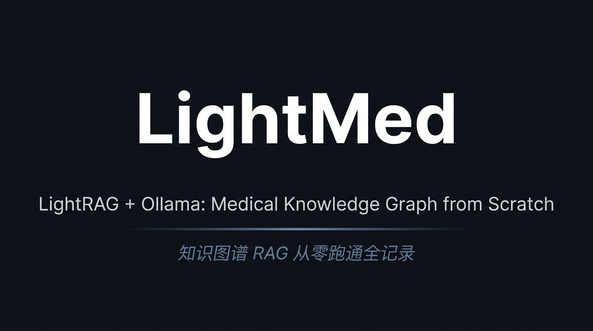

<div align="center">



**LightRAG + Ollama: Medical Knowledge Graph from Scratch**

*知识图谱 RAG 从零跑通全记录*

---


</div>

---

## 为什么叫 LightMed？

**Light** 来自 [LightRAG](https://github.com/HKUDS/LightRAG)——这个项目的核心引擎，它把知识图谱和向量检索结合在一起，让 RAG 系统真正"理解"实体之间的关联，而不只是做字面匹配。**Med** 代表医疗（Medical），这是我选择的实验领域。

学知识图谱 RAG 有一道坎：理论很好懂，跑起来一塌糊涂。本地 7B 模型跑 LightRAG，文档一长就超时，并发一开就崩溃，到处是"ReadTimeout"。这个仓库就是我把这道坎翻过去的完整记录。

这不是一个框架，也不是生产工具。它是我作为 RAG 初学者的第一次实践——用 LightRAG 现有的 API，在本地把医疗知识图谱从零跑通，然后把所有踩过的坑记录下来。

如果你也在用本地模型跑 LightRAG，希望这里的记录能帮你少掉几根头发。

---

## 遇到的问题与解决方案

这一节是这个仓库最有价值的部分。官方文档没有告诉你在消费级硬件上会发生什么。

### 问题一：插入知识图谱时频繁超时

**现象**：处理几个文档后出现 `ReadTimeout` 或 `httpx.ReadTimeout`，进程在处理 10~20 个 chunk 后无声无息地挂掉，存储目录里留下不完整的图谱文件。

**原因**：LightRAG 在插入时会调用 LLM 对每个文本块提取实体和关系。本地 7B 模型的推理速度远比云端 API 慢，默认超时完全不够用。

**解决方案**：把超时拉到你认为"不可能这么慢"的程度，然后再翻倍。

```python
llm_model_kwargs={
    "host": "http://localhost:11434",
    "options": {"num_ctx": 8192},
    "timeout": 1200,  # 20 分钟，是的，真的需要这么长
}
```

对应配置文件中的设置（`configs/model_config.yaml`）：

```yaml
llm:
  model: "qwen2.5:7b"
  timeout: 1200       # 别改小，除非你的显卡比我好很多

embedding:
  model: "bge-m3:latest"
  timeout: 1800       # 30 分钟
```

---

### 问题二：并发请求把本地模型压垮

**现象**：LightRAG 默认会并发调用 LLM，在本地 7B 模型上会触发显存溢出或连锁超时，表现为多个任务同时失败。

**原因**：云端 API 并发没问题，本地 GPU 显存有限，多个推理请求同时占用显存会直接 OOM。

**解决方案**：`asyncio.Semaphore(1)` 强制串行，慢但稳。

```python
self._semaphore = asyncio.Semaphore(1)

async with self._semaphore:
    await self.rag.ainsert(doc_content)
    await asyncio.sleep(1.0)  # 每次插入后让模型喘口气
```

---

### 问题三：文档太长，LightRAG 内部分块后仍然超时

**现象**：LightRAG 自身有分块机制，但对于超过 5000 字的医疗长文档，即使经过内部分块，单个 chunk 的实体提取依然超时。

**原因**：内部分块后 chunk 的字符数仍然可能较大，实体提取 LLM 调用时间超出超时限制。

**解决方案**：在传入 LightRAG 之前先做一轮预处理分块，目标约 1000 字符，尽量在句号处截断。

```python
if len(content) > 3000:
    for i in range(0, len(content), 1000):
        chunk = content[i:i + 1000]
        # 在句号处截断，避免切断完整语句
        if '。' in chunk:
            last_period = chunk.rfind('。')
            if last_period > 700:
                chunk = chunk[:last_period + 1]
        await self.rag.ainsert(chunk)
        await asyncio.sleep(1.0)
```

最终是双重分块：我的预处理在外层，LightRAG 的内部分块在里层。这个组合才让整个插入过程稳定下来。

---

## 系统结构

```
浏览器（HTML 网页客户端）
    |
    | HTTP
    v
FastAPI 服务端  (medical_rag_api_server.py)
    |
    v
RAGManager + ModelManager  (src/core/)
    |
    | LightRAG API
    v
LightRAG  （知识图谱构建与检索）
    |
    | HTTP
    v
Ollama  （qwen2.5:7b + bge-m3，完全本地运行）
    |
    v
本地存储  (medical_json_small_storage/)
```

LightRAG 支持四种查询模式，均为原始实现，本项目直接调用：

| 模式 | 说明 |
|------|------|
| `naive` | 纯向量相似度检索，速度最快 |
| `local` | 从最相关实体出发做图谱局部遍历 |
| `global` | 利用图谱全局社区摘要信息 |
| `hybrid` | 三者综合，效果最好，推荐 |

---

## 快速开始

### 环境要求

- Python 3.9+
- [Ollama](https://ollama.ai/) 本地运行
- 建议 8GB 以上内存，6GB 以上显存的 GPU

### 安装

```bash
git clone https://github.com/gulugulu-sama/LightMed.git
cd LightMed
pip install -r requirements.txt
```

拉取模型（第一次需要下载，耐心等待）：

```bash
ollama pull qwen2.5:7b
ollama pull bge-m3:latest
```

### 第一步：构建知识图谱（只需执行一次）

将你的 `.txt` 文档放入 `knowledge_bases/` 目录，然后运行：

```bash
python medical_rag_kb_official.py
```

这个过程需要较长时间。以我的机器（RTX 3060 12GB）为例，约 50 篇中等长度文档大约需要 2 小时。请不要中断。

### 第二步：启动服务

```bash
# Windows
start_api_server.bat

# Linux / macOS
python medical_rag_api_server.py
```

然后用浏览器打开 `medical_rag_web_client_optimized.html` 即可。

---

## 项目结构

```
LightMed/
├── src/core/
│   ├── rag_manager.py              # 封装 LightRAG 初始化与查询
│   ├── model_manager.py            # 管理 Ollama 模型状态
│   ├── kb_manager.py               # 知识库文件加载与预处理分块
│   ├── query_optimizer.py          # 查询意图分类与自适应模式选择
│   └── enhanced_rag_manager.py     # 集成查询优化器的增强版
├── configs/
│   ├── model_config.yaml           # 模型参数（超时等关键配置）
│   ├── rag_config.yaml             # LightRAG 全部参数
│   ├── medical_config.yaml         # 医疗领域实体类型
│   ├── existing_graph_config.yaml  # 使用已有图谱时的配置
│   └── json_rag_config.yaml        # JSON 格式数据的配置
├── medical_rag_api_server.py       # FastAPI 后端主服务
├── medical_rag_kb_official.py      # 知识图谱构建脚本（首次运行）
├── medical_rag_web_client_optimized.html  # 网页客户端
├── main.py                         # 命令行交互模式
├── quick_start.py                  # 环境验证脚本
├── Dockerfile                      # Docker 部署
├── docker-compose.yml
└── requirements.txt
```

---

## Docker 部署

```bash
docker-compose up -d
```

详见 `INSTALL.md`。

---

## 致谢

- [LightRAG](https://github.com/HKUDS/LightRAG) — 本项目所有核心能力的来源，没有它这个项目不存在
- [Ollama](https://ollama.ai/) — 让在本地跑大模型这件事真正变得可行

---

## 医疗声明

本系统仅供个人学习和研究使用，不适用于任何临床诊断或医疗决策场景。如有健康问题，请咨询专业医生。
